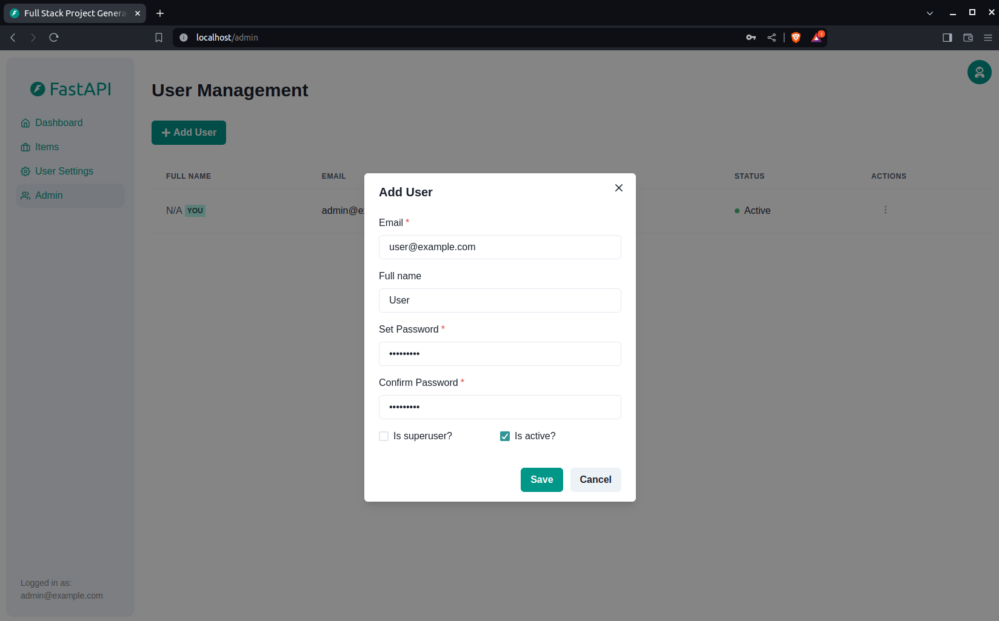
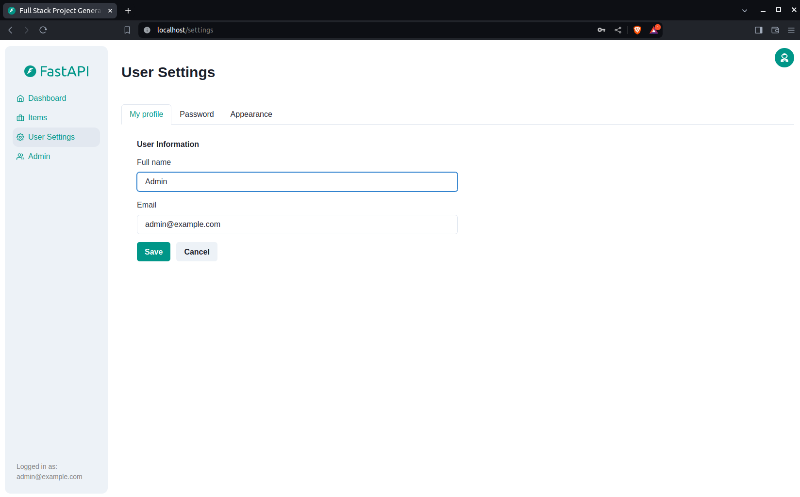
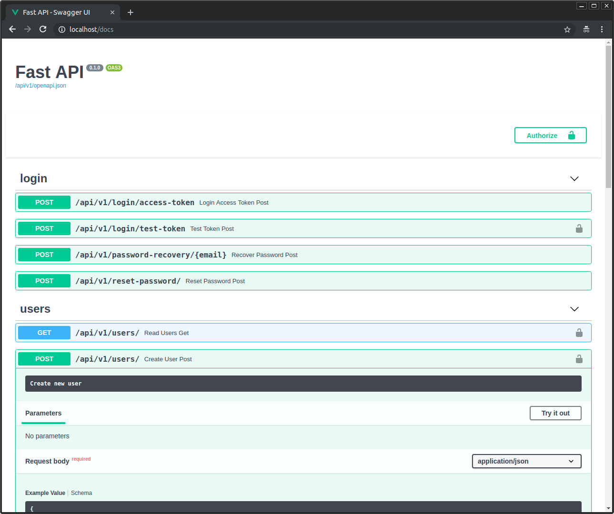

# fastapi-attendance-system

A fullstack graduation project using FastAPI for the backend and React for the frontend.

---

## Full Stack FastAPI Template

<a href="https://github.com/fastapi/full-stack-fastapi-template/actions?query=workflow%3ATest" target="_blank"></a>
<a href="https://coverage-badge.samuelcolvin.workers.dev/redirect/fastapi/full-stack-fastapi-template" target="_blank"></a>

### Technology Stack and Features
- ⚡ **FastAPI** for the Python backend API.
- 🧰 SQLModel (ORM), 🔍 Pydantic for data validation.
- 💾 PostgreSQL as the database.
- 🚀 React frontend using TypeScript, Chakra UI, etc.
- 🐋 Docker Compose for development and deployment.
- 🔒 JWT authentication, password recovery, and more.

### Screenshots








---

## How to Use

You can fork or clone this repo and follow the instructions in the documentation files:

- `backend/README.md`
- `frontend/README.md`
- `deployment.md`
- `development.md`

To generate a secure key:
```bash
python -c "import secrets; print(secrets.token_urlsafe(32))"
